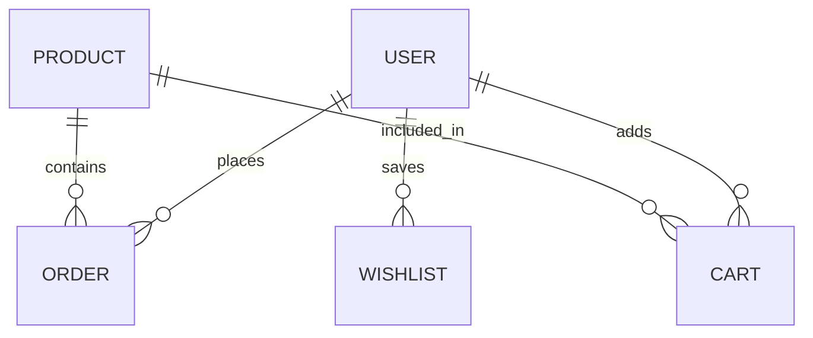

# Project Report: Anease Skincare E-Commerce Platform

---

## TABLE OF CONTENTS
1. [ACKNOWLEDGEMENT](#acknowledgement)
2. [ABSTRACT](#abstract)
3. [LIST OF FIGURES](#list-of-figures)
4. [LIST OF TABLES](#list-of-tables)
5. [LIST OF ABBREVIATIONS](#list-of-abbreviations)
6. [CHAPTER 1: INTRODUCTION](#chapter-1-introduction)
    - 1.1 Introduction and Background
    - 1.2 Problem Statement
    - 1.3 Objectives
    - 1.4 Scope and Limitations
    - 1.5 Development Methodology
7. [CHAPTER 2: BACKGROUND STUDY AND LITERATURE REVIEW](#chapter-2-background-study)
    - 2.1 Background Study
    - 2.2 Literature Review
8. [CHAPTER 3: SYSTEM ANALYSIS](#chapter-3-system-analysis)
    - 3.1 Requirements Analysis
    - 3.2 Feasibility Analysis
    - 3.3 System Analysis (Use Case, DFD, ERD)
9. [CHAPTER 4: DESIGN AND IMPLEMENTATION](#chapter-4-design-and-implementation)
    - 4.1 System Design
    - 4.2 Algorithm Details (Skin Type Diagnosis)
10. [CHAPTER 5: IMPLEMENTATION AND TESTING](#chapter-5-implementation-and-testing)
    - 5.1 Tools Used
    - 5.2 Test Cases
11. [CHAPTER 6: CONCLUSION AND FUTURE RECOMMENDATIONS](#chapter-6-conclusion)
12. [REFERENCES](#references)

---

## ACKNOWLEDGEMENT
I would like to express my gratitude to everyone who contributed to the successful completion of the Anease Skincare project. Special thanks to the mentors and the community for providing the tools and knowledge necessary to build this comprehensive Laravel-based application.

## ABSTRACT
Anease Skincare is a web-based e-commerce application developed using the Laravel framework. The primary goal of this project is to bridge the gap between users and appropriate skincare products by integrating a personalized skin type diagnostic tool. The system allows users to find their skin type through a guided questionnaire and receive tailored product recommendations and routines. The project also features a robust admin dashboard for business management, ensuring a seamless experience for both customers and administrators.

---

## LIST OF FIGURES
- Figure 3.1: Agile Development Life Cycle
- Figure 3.2: System Use Case Diagram
- Figure 3.3: Data Flow Diagram (Level 0)
- Figure 3.4: Entity Relationship Diagram (ERD)
- Figure 4.1: Model-View-Controller (MVC) Architecture

## LIST OF TABLES
- Table 5.1: Test Case for User Registration
- Table 5.2: Test Case for Skin Type Recommendation
- Table 5.3: Test Case for eSewa Payment Integration

## LIST OF ABBREVIATIONS
- **MVC**: Model View Controller
- **PHP**: Hypertext Preprocessor
- **SQL**: Structured Query Language
- **ERD**: Entity Relationship Diagram
- **DFD**: Data Flow Diagram
- **CSRF**: Cross-Site Request Forgery
- **COD**: Cash on Delivery

---

## CHAPTER 1: INTRODUCTION

### 1.1 Introduction and Background
In the modern era, skincare has become a vital part of personal health and wellness. However, with the abundance of products in the market, consumers often struggle to identify which products are truly suitable for their specific skin conditions. Anease Skincare addresses this by combining a traditional e-commerce store with a diagnostic "Skin Type Finder" tool.

### 1.2 Problem Statement
Traditional skincare shopping relies on trial and error, which can be expensive and harmful to the skin. There is a lack of accessible, automated platforms that guide users toward the right products based on dermatological basics (Skin Type: Oily, Dry, Combination, Normal).

### 1.3 Objectives
- To develop a secure e-commerce platform for skincare products.
- To implement a questionnaire-based logic to determine user skin types.
- To provide personalized skincare routines and product suggestions.
- To build a comprehensive admin panel for inventory and sales tracking.

### 1.4 Scope and Limitations
**Scope**:
- User authentication and profile management.
- Cart and wishlist functionality.
- Automated skin type diagnosis.
- Admin dashboard with revenue analytics.

**Limitations**:
- The diagnosis is based on user input, not medical-grade imaging.
- Internet connectivity is required for real-time recommendations.

### 1.5 Development Methodology
This project followed the **Agile Development Methodology**, allowing for iterative updates, continuous testing, and rapid integration of new features based on feedback.

---

## CHAPTER 3: SYSTEM ANALYSIS

### 3.1 Requirements Analysis

#### 3.1.1 Functional Requirements
- **FR1**: System must allow users to register and login.
- **FR2**: System must provide a Skin Type Finder questionnaire.
- **FR3**: System must filter products based on skin concern results.
- **FR4**: System must support multiple payment gateways (eSewa, COD).

#### 3.1.2 Non-Functional Requirements
- **Performance**: Pages should load within 2-3 seconds.
- **Security**: Password hashing and CSRF protection must be implemented.
- **Scalability**: The system should handle increasing product listings and user traffic.

### 3.3 System Analysis Diagrams

#### Use Case Diagram
```mermaid
useCaseDiagram
    actor User
    actor Admin
    User -> (Find Skin Type)
    User -> (Purchase Products)
    User -> (Manage Wishlist)
    Admin -> (Manage Products)
    Admin -> (View Sales Analytics)
```

#### Entity Relationship Diagram (ERD)


---

## CHAPTER 4: DESIGN AND IMPLEMENTATION

### 4.1 System Design
The application is built using the **MVC (Model-View-Controller)** pattern:
- **Models**: Handle database interactions (Product.php, Order.php, etc.).
- **Views**: Handle the UI/UX using Blade templates (home.blade.php, recommendation.blade.php).
- **Controllers**: Handle business logic and routing (SuchiController.php).

### 4.2 Algorithm Details (Skin Type Diagnosis)
The skin type is calculated based on a weighted scoring system from the user's questionnaire responses.
```javascript
// Pseudo-code for calculation
let scores = { oily: 0, dry: 0, combo: 0, normal: 0 };
answers.forEach(ans => scores[ans]++);
let result = max(scores);
```

---

## CHAPTER 5: IMPLEMENTATION AND TESTING

### 5.1 Tools Used
- **IDE**: Visual Studio Code
- **Server**: XAMPP (Apache, MySQL)
- **Framework**: Laravel 10+
- **Styling**: Bootstrap 5, CSS3
- **Scripting**: PHP 8.1+, JavaScript

### 5.2 Test Cases

| ID | Feature | Input | Expected Output | Status |
|----|---------|-------|-----------------|--------|
| TC01 | Registration | Valid Email/Pass | Account Created | Pass |
| TC02 | Recommendation | Answers: Oily skin | "You have Oily Skin" message | Pass |
| TC03 | Payment | eSewa Initiate | Redirect to eSewa Portal | Pass |

---

## CHAPTER 6: CONCLUSION AND FUTURE RECOMMENDATIONS

### 6.1 Conclusion
The Anease Skincare project successfully demonstrates the integration of personalized health tools within an e-commerce ecosystem. By providing users with data-driven product suggestions, the platform enhances customer trust and reduces the risk of skin irritation from incorrect product usage.

### 6.2 Future Recommendation
- Integration of **AI-powered face scanning** for more accurate diagnosis.
- Implementing a **subscription model** for recurring skincare supplies.
- Adding a **community forum** for user reviews and skincare tips.

---

## REFERENCES
1. Laravel Documentation (laravel.com)
2. Bootstrap 5 Guide (getbootstrap.com)
3. Dermatological studies on skin type classification (WHO/Dermatology Journals).
